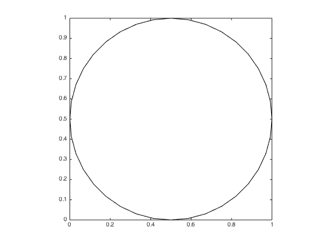
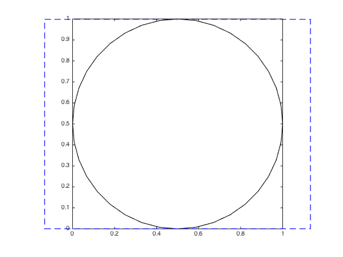
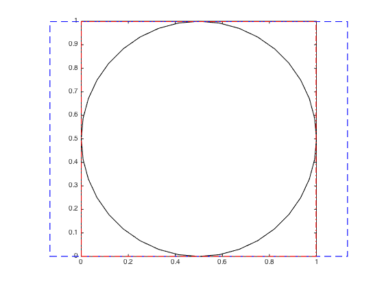

## plotboxpos.m Documentation

This function returns the position of the plotted region of an axis,
  which may differ from the actual axis position, depending on the axis
  limits, data aspect ratio, and plot box aspect ratio.  The position is
  returned in the same units as the those used to define the axis itself.
  This function can only be used for a 2D plot.

### Syntax
```
pos = plotboxpos(h)
```
See function help for description of input and output variables.

### Example

 
 We start by plotting a circle, changing the axis aspect ratio to be
 1:1 and the axis limits to be tight to the data.

```matlab
ax(1) = axes;
h.ex = rectangle('position', [0 0 1 1], 'curvature', [1 1]);
axis tight equal;
box on;
```



 The axis 'Position' property still corresponds to the full potential axis
 space, discounting the axis modifications we just made.

```matlab
pos1 = get(ax(1), 'position');

ax(2) = axes('position', [0 0 1 1], ...
             'visible', 'off', ...
             'xlim', [0 1], ...
             'ylim', [0 1]); 
r(1) = rectangle('position', pos1, 'edgecolor', 'b', 'linestyle', '--');
```



 The plotboxpos function returns the position the axis is actually using
 with its current axis ratio settings;

```matlab
pos2 = plotboxpos(ax(1));
r(2) = rectangle('position', pos2, 'edgecolor', 'r', 'linestyle', '-.');
```

